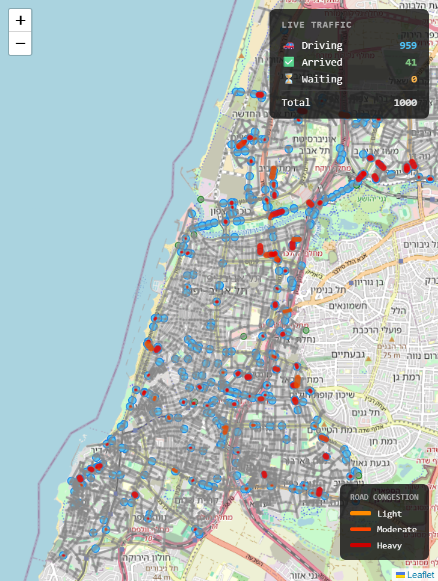
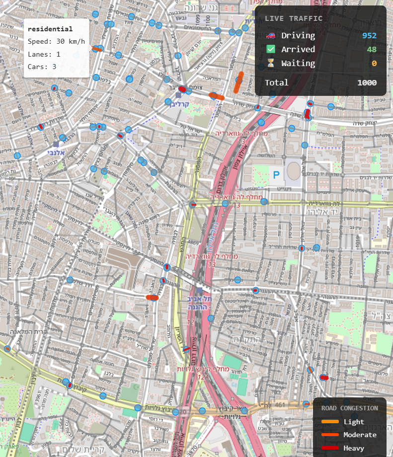

# Waze — Concurrent Traffic Routing Engine

A high-performance, multithreaded routing server written in **C** with a full Python simulation ecosystem.
Inspired by real navigation systems: concurrent clients, live A\* routing, EMA-smoothed traffic updates, flow-field batch simulation, and a real-time map visualization — all running on real Tel Aviv street data.

---

## Table of Contents

- [Overview](#overview)
- [Screenshots](#screenshots)
- [Architecture](#architecture)
- [Docker (quickest start)](#docker-quickest-start)
- [Getting Started](#getting-started)
- [Graph Data](#graph-data)
- [Protocol](#protocol)
- [Simulations](#simulations)
- [Flow-Field Batch Driver](#flow-field-batch-driver)
- [Live Map Visualization](#live-map-visualization)
- [Load Testing](#load-testing)
- [Project Structure](#project-structure)
- [Authors](#authors)

---

## Overview

This project implements the core of a navigation system from scratch:

| Layer | Technology | What it does |
|---|---|---|
| **Routing server** | C, pthreads | Concurrent TCP server, A\* pathfinding, live traffic |
| **Vehicle simulation** | Python (ThreadPoolExecutor) | Thousands of cars requesting routes, sending speed reports |
| **Flow-field engine** | Python, NumPy | Pre-computed Dijkstra wavefronts for massively parallel routing |
| **Live visualization** | Leaflet.js, Python HTTP bridge | Real-time map of car positions and road congestion |
| **Real-world graph** | OSM / osmnx | Actual Tel Aviv street network with geometry and speeds |

### What makes it interesting

- **Three-tier concurrency**: accept thread → per-client threads → read/write worker pools. Routing queries run in parallel under a reader lock; traffic updates serialize under a writer lock.
- **Live A\* routing**: the A\* heuristic uses actual lat/lon coordinates. Edge weights reflect real-time EMA-smoothed travel times from speed reports.
- **Congestion model**: road capacity is modeled per lane. As occupancy rises, speed degrades linearly — down to a minimum of 10% (JAM_SPEED_FACTOR) to prevent full gridlock.
- **Flow-field routing**: for large-scale simulations, the map is divided into geographic sectors. A one-time Dijkstra wavefront per sector pre-computes a flow field pointing every cell toward that sector. Cars at scale follow flow vectors instead of running individual A\* searches.
- **Adaptive rerouting**: the batch driver monitors edge congestion every 10 ticks and re-routes cars that have jammed segments ahead.

---

## Screenshots

<div align="center">
  
  &nbsp;
  
  <br/>
  <sub><b>Left:</b> 1000 simulated cars on the Tel Aviv street network &nbsp;|&nbsp; <b>Right:</b> hover any road to inspect its live metrics</sub>
</div>

---

## Architecture

### Concurrency Model

```
TCP client  ──►  client_thread  ──►  routing_q  ──►  ROUTE_WORKERS (8)  ─┐
                                                                           ├──► graph (rwlock)
TCP client  ──►  client_thread  ──►  traffic_q  ──►  TRAFFIC_WORKERS (2) ─┘
```

1. **Accept thread** — accepts connections, spawns a detached client thread per socket.
2. **Client threads** — parse one request at a time, create a `Task`, push it to the appropriate queue, then **block on a condition variable** until a worker signals completion. This guarantees ordered responses per connection.
3. **Worker pools** — two pools share one `pthread_rwlock_t` over the graph:
   - Routing workers hold a **read lock** (multiple can run in parallel).
   - Traffic workers hold a **write lock** (exclusive, serialized).

### Graph

```
Graph
 ├── nodes[MAX_NODES = 100 000]    fixed array
 │    └── Node { node_id, lat, lon, out_edges → [EdgeNode] }
 └── edges[]                       dynamic array
      └── Edge { from, to, base_length, base_speed_limit,
                 current_travel_time, ema_travel_time, observation_count,
                 road_type, lanes, is_oneway }
```

- Node coordinates are used for the **admissible A\* heuristic** (equirectangular distance ÷ max graph speed).
- Travel times are initialized from `base_length / base_speed_limit` and updated live via EMA.

### A\* Routing

`routing.c` implements A\* over the directed graph using a **binary min-heap** (`min_heap.c`) as the open set.
The heap tracks node positions with a position array for O(log N) `decreaseKey`. The function returns the edge-ID path, the node-ID path, and total estimated travel time.

### Traffic EMA

When a car reports its speed on an edge:

```
measured = base_length / reported_speed
alpha    = 1.0   (first observation)
alpha    = 0.2   (subsequent observations)
ema      = alpha * measured + (1 - alpha) * ema
```

A 20% weight on new observations smooths out noise while still reacting to sustained changes.

### Vehicle Physics

Cars are tracked server-side with `{edge_index, position [0–1]}`. On each tick:

```
speed   = base_speed × congestion_factor
advance = (speed × dt) / edge_length
```

If `position ≥ 1.0`, the car moves to the next edge and the remaining time propagates recursively — so one tick can cross multiple short edges cleanly.

**Congestion factor**:
```
occupancy       = cars currently on edge
capacity        = lanes × CARS_PER_LANE (5)
cong_factor     = max(0.1, 1.0 − occupancy / capacity)
```

`TICK_ALL` pre-computes a single occupancy array for all edges before advancing any car — O(N) instead of O(N²).

---

## Docker (quickest start)

```bash
docker compose up
```

That's it. On first run the container downloads the Tel Aviv street network from OpenStreetMap (~1–2 min, one-time), builds the flow-field cache (~30 s, one-time), then starts 1000 simulated cars.

Open **http://localhost:8090/map.html** to see cars moving in real time. Subsequent `docker compose up` calls start instantly from the cached data.

```bash
# Reset all cached data (forces fresh OSM download + flow-field rebuild)
docker compose down -v
```

### Simulation modes

| Mode | Command | Cars | Routing |
|---|---|---|---|
| **Flow-field** (default) | `docker compose up` | 500+ | Pre-computed sector flow fields; one `TICK_ALL` per tick |
| **Car simulation** | `docker compose --profile car-sim up --scale flow-sim=0` | ~10–100 | Per-car A\* via individual TCP calls |

The flow-field mode scales much better and is the recommended default. The car simulation mode gives finer per-car control and is useful for debugging or interactive routing.

---

## Getting Started

### 1. Build the server

```bash
make          # compile
make run      # compile and start (port 8080)
make clean    # remove binary
```

Compiler: `gcc -Wall -Wextra -std=c11 -O2 -lm -pthread`

Override worker pool sizes at compile time:
```bash
make CFLAGS="-Wall -Wextra -std=c11 -O2 -DROUTE_WORKERS=16 -DTRAFFIC_WORKERS=4"
```

### 2. Generate graph data

```bash
# Synthetic graph (fast, good for testing)
python3 generate_graph.py --nodes 1000 --edges 3000

# Real-world Tel Aviv graph from a .graphml file (via osmnx)
python3 scripts/convert_graph.py <file.graphml>
```

The server requires `data/graph.meta`, `data/nodes.csv`, `data/edges.csv` before starting. The `data/` directory is gitignored.

### 3. Run a simulation

```bash
# Terminal 1
./server

# Terminal 2 — 20 cars, 200 steps, 8 parallel threads
python3 car_client.py --mode sim --cars 20 --steps 200 --sim-workers 8

# Or: interactive routing REPL
python3 car_client.py --mode interactive
```

### 4. Flow-field simulation with live map

```bash
# Terminal 1
./server

# Terminal 2 — 500 cars, 3×3 sector grid
python3 flow_field_driver.py --cars 500 --data-dir data --nx 3 --ny 3
# Flow fields are computed once and cached; subsequent runs start instantly.

# Terminal 3 (optional) — desktop map viewer
python3 gui/gui.py
# Or open http://localhost:8090/map.html in a browser
```

---

## Graph Data

### `data/graph.meta`
```
num_nodes <N>
num_edges <M>
```

### `data/nodes.csv`
```
node_id,lat,lon
```

### `data/edges.csv`
```
edge_id,from_node,to_node,base_length,base_speed_limit,road_type,lanes,is_oneway
```

The graph is directed. The loader handles large OSM node IDs (> INT\_MAX) via a two-pass remapping: first pass builds a sorted `raw_id → sequential_index` table, second pass binary-searches it during edge loading.

---

## Protocol

Line-based TCP. JSON is the primary format; `PRED`, `POSITIONS`, `CONGESTION`, and `TICK_ALL` use plain text.

### Routing request
```json
{"user_id": 1, "car_id": 1, "start_node": 10, "destination_node": 42, "timestamp": 0.0}
```
```json
{"user_id": 1, "car_id": 1, "route_edges": [100, 233, 912], "eta": 47.31}
```
```json
{"error": "NO_ROUTE", "user_id": 1, "car_id": 1}
```

### Traffic update
```json
{"user_id": 1, "car_id": 1, "edge_id": 233, "speed": 16.2, "position_on_edge": 0.45, "timestamp": 13.0}
```
```json
{"status": "ACK", "user_id": 1, "car_id": 1}
```

### Vehicle management
```json
{"register_car": 1, "user_id": 1, "car_id": 1, "start_node": 0, "destination_node": 99}
{"tick_car": 1, "car_id": 1, "dt": 1.0}
{"register_route": 1, "car_id": 1, "start_node": 0, "dest_node": 99, "route_edges": [0, 5, 7]}
```

### Bulk queries (plain text)
```
POSITIONS          → JSON array of {car_id, lat, lon, state}
CONGESTION         → JSON array of {edge_id, occupancy, capacity, ...}
TICK_ALL 1.0       → advances all registered cars by 1 second
PRED <edge_id>     → PRED <edge_id> <predicted_travel_time>
```

Manual testing:
```bash
nc 127.0.0.1 8080
```

---

## Simulations

### `car_client.py` — car simulation + interactive REPL

**Simulation mode** (`--mode sim`):
- Each car runs in a thread: `register_car` → loop of `tick_car` until arrived → repeat
- Cars send periodic speed reports back to the server, feeding EMA traffic updates
- Prints a summary at the end: state breakdown, average trip length

**Interactive mode** (`--mode interactive`):
- Type routes manually; get back edge lists and ETAs
- `pred <edge_id>` queries the traffic prediction for any edge

```bash
python3 car_client.py --mode sim --cars 50 --steps 500 --dt 2.0 --sim-workers 16
python3 car_client.py --mode interactive
```

---

## Flow-Field Batch Driver

`flow_field_driver.py` is an alternative large-scale simulation that separates routing into two phases:

### Phase 1 — Pre-computation (run once, cached as `.npz`)

1. **Grid** (`flow_field/grid.py`): rasterize the road network onto a uniform 2D grid (~100m cells) using Bresenham's line algorithm. Each cell stores a traversal cost derived from road type, speed, and lanes.

   Road type cost factors: `motorway = 1.0`, `primary = 0.7`, `residential = 0.4`, `service = 0.25`

2. **Integration field** (`flow_field/fields.py`): run multi-source Dijkstra outward from all destination cells. Every cell records its minimum-cost distance to the destination. O(N log N).

3. **Flow field** (`flow_field/fields.py`): vectorized NumPy pass — for each cell, find the steepest-descent neighbor among 8 directions and store a unit-length (vx, vy) vector. No Python loops.

### Phase 2 — Simulation loop

- The map is divided into NX×NY geographic sectors. Each sector has its own cached flow field.
- Cars pick a destination sector, use `pick_destination()` to find a node in that sector, A\* route to it, and register the route with the C server.
- Main loop calls `TICK_ALL` every iteration. Arrived cars dwell (5–15 s), then get a new destination.
- Every 10 ticks: query `CONGESTION`, evict cached A\* routes through jammed edges, reroute affected cars.

**Agent movement** (`flow_field/agents.py`):
- Near destination (within last-mile radius): direct unit vector to goal node
- Far from destination: bilinear interpolation of flow field at continuous (col, row)
- Separation forces via spatial hash (3×3 bucket search) prevent clustering

```bash
python3 flow_field_driver.py --cars 500 --data-dir data --nx 3 --ny 3
# First run builds flow fields (~1–2 min). Subsequent runs load cache and start instantly.
```

---

## Live Map Visualization

### HTTP Bridge (`gui/bridge.py`)

The C server speaks TCP; the browser needs HTTP. `bridge.py` runs two things in parallel:
- **Polling thread**: queries `POSITIONS` and `CONGESTION` from the server every 500ms, caches results.
- **HTTP server** (port 8090): serves `/positions`, `/congestion`, `/metrics`, and the static `map.html`.

### Map (`gui/map.html`)

Built with Leaflet.js on OpenStreetMap tiles.

- **Car markers**: colored by state — driving (blue), arrived (green), idle (orange)
- **Road overlay**: all road segments are drawn on startup from the graph data and updated every 500ms
- **Congestion overlay**: road segments colored by occupancy — orange (light), red (heavy)
- **Road hover tooltips**: hover over any road segment to see its real-time metrics — road type, speed limit, and current number of cars on that segment
- **Live metrics panel**: driving / arrived / idle / total counts, updated every 500ms

### Desktop launcher (`gui/gui.py`)

Wraps `map.html` in a PySide6 QWebEngineView window. Falls back to Chrome (for WSL) or the system browser.

```bash
python3 gui/gui.py
# or just open http://localhost:8090/map.html
```

---

## Load Testing

`load_test.py` hammers the server with concurrent routing and traffic requests to verify stability under parallel load.

```bash
python3 load_test.py --num-nodes 1000 --num-edges 3000
```

Default workload: 32 routing clients × 50 requests + 8 traffic clients × 100 updates, all concurrent.
Reports: throughput (ops/sec), latency percentiles (p50 / p90 / p99), timeout counts.

---

## Project Structure

```
.
├── src/
│   ├── main.c              # Entry point — loads graph, starts server
│   ├── server.c / .h       # TCP server, worker pools, vehicle simulation (~1340 lines)
│   ├── graph.c / .h        # Graph struct, heuristic, edge weights
│   ├── graph_loader.c / .h # CSV parser, OSM ID remapping (two-pass)
│   ├── routing.c / .h      # A* pathfinding
│   └── min_heap.c / .h     # Binary min-heap for A* open set
│
├── flow_field/
│   ├── fields.py           # Dijkstra integration field + vectorized flow field
│   ├── grid.py             # Grid rasterization, cost field, Bresenham
│   ├── agents.py           # Agent movement, bilinear sampling, spatial hash
│   └── loader.py           # CSV → Grid pipeline
│
├── gui/
│   ├── bridge.py           # HTTP / TCP bridge (polling + REST endpoints)
│   ├── gui.py              # Qt desktop launcher
│   └── map.html            # Leaflet live visualization
│
├── scripts/
│   └── convert_graph.py    # .graphml (osmnx) → CSV converter
│
├── data/                   # Graph files — gitignored, generated locally
│   ├── graph.meta
│   ├── nodes.csv
│   └── edges.csv
│
├── generate_graph.py       # Synthetic graph generator
├── car_client.py           # Car simulation + interactive client
├── flow_field_driver.py    # Multi-area flow-field simulation + HTTP backend
├── load_test.py            # Concurrent load tester
└── makefile
```

---

## Authors

- **Eliron Picard**
- **Roy Meiri**
