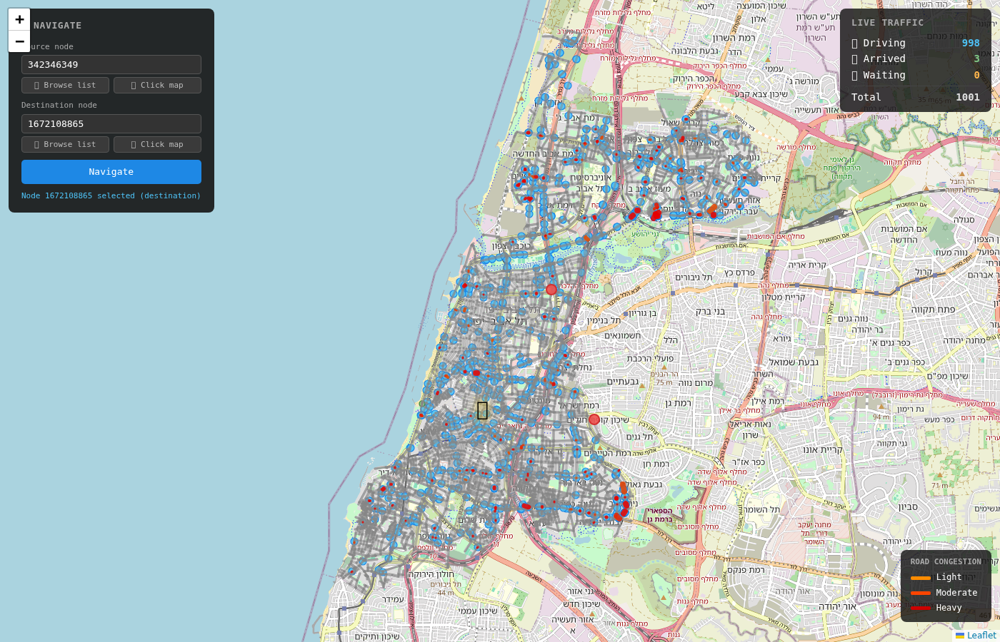
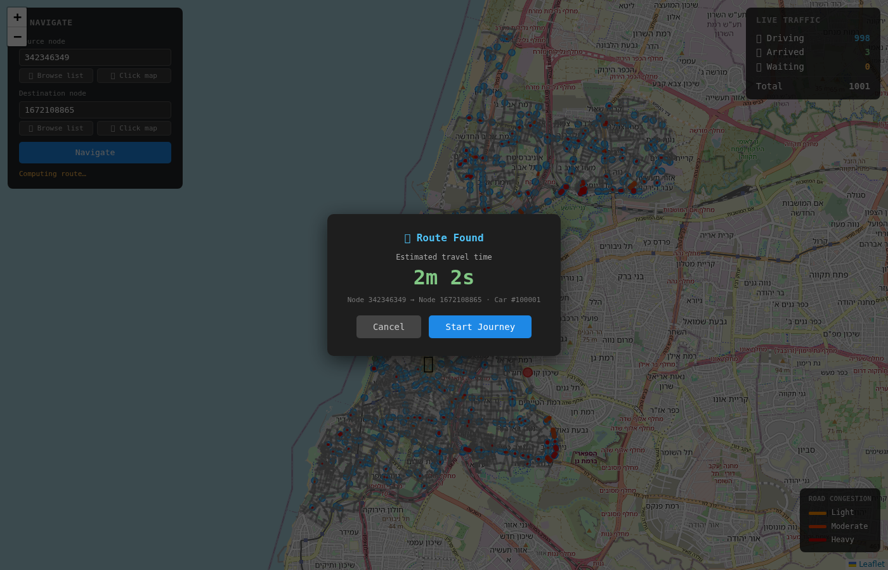

<div align="center">

# 🗺️ Waze — Real-Time GPS Navigation & Traffic Simulation

[](https://en.wikipedia.org/wiki/C11_(C_standard_revision))
[](https://python.org)
[](LICENSE)
[](Dockerfile)
[]()

**A production-grade GPS navigation engine** built from scratch in C with Python tooling — featuring concurrent A\* routing, live traffic ingestion, congestion physics, and a real-time web map powered by Tel Aviv's OpenStreetMap road network.

*Parallel & Distributed Programming — Course Project*

---

</div>

## 📸 Screenshots

<div align="center">

| Select Source | Select Destination |
|:---:|:---:|
|  |  |

| ETA Confirmation | Live Navigation |
|:---:|:---:|
|  |  |

</div>

---

## 🚀 Quick Start

**Using Docker (recommended — zero setup):**

```bash
# Build and launch everything (server + 500 simulated cars + web UI)
docker compose up --build

# Open the live map
open http://localhost:8090/map.html
```

> On first run, the container automatically downloads the Tel Aviv road network from OpenStreetMap (~1–2 min). Subsequent runs start immediately from the cached graph.

**Local build:**

```bash
# 1. Download the Tel Aviv road network (once)
pip install osmnx numpy
python3 scripts/download_tel_aviv.py --out data/

# 2. Build and run the C server
make run          # starts listening on TCP port 8080

# 3. Launch the flow-field simulation (built-in HTTP bridge on port 8090)
#    First run builds and caches the sector flow fields (~30 s):
python3 flow_field_driver.py --cars 500 --data-dir data --nx 3 --ny 3

#    Subsequent runs load from cache and start immediately:
python3 flow_field_driver.py --cars 500 --data-dir data

# Open the live map
open http://localhost:8090/map.html
```

---

## ✨ Features

| Feature | Details |
|---|---|
| 🌊 **Sector flow-field simulation** | Map divided into NX×NY sectors; each has a pre-computed Dijkstra flow field. `flow_field_driver.py` routes 500–1,000+ cars continuously, rerouting around jams in real time |
| ⚡ **Concurrent A\* routing** | Up to 32 parallel routing workers (configurable via `--workers`); TASK_REQ reads `_Atomic current_travel_time` lock-free. Flat binary heap + generation counter gives O(1) scratch-space reset per call |
| 🔀 **Parallel TICK\_ALL** | Vehicle advancement split across 4 threads (`N_TICK_WORKERS`); edge occupancy transitions use `__atomic_fetch_add/sub` — no mutex required |
| 📦 **Persistent segment worker pool** | 8 dedicated segment workers (`SEG_WORKERS`) each holding a pre-allocated `RouteContext`; replaces per-batch `pthread_create/join` pairs, eliminating repeated A\* malloc overhead |
| 🔒 **Striped edge mutex** | 64-bucket stripe mutex (`N_EDGE_STRIPES`) replaces a single global write lock for EMA updates — traffic workers on different edges never contend |
| 🔄 **Live traffic ingestion** | EMA-smoothed edge weights updated by car speed reports |
| 🚗 **30,000 simulated vehicles** | Server-side physics with congestion modeling (server capacity) |
| 🗺️ **Real-world map** | Tel Aviv OpenStreetMap drive network (6,500 nodes / 12,470 edges) |
| 🌐 **Interactive web UI** | Leaflet.js map with car positions, congestion overlays, route planner |
| 📡 **Buffered TCP reads** | `RecvBuf` (4 096-byte buffer) batches `recv()` syscalls; replaces one-byte-per-call `recv_line` — cuts per-request syscall count by ~100–500× |
| 🐳 **Docker Compose** | One-command deployment of the full simulation stack |
| 🔮 **Travel time prediction** | EMA-based per-edge prediction endpoint |

---

## 🏗️ Architecture

### System Overview

```
┌──────────────────────────────────────────────────────────────┐
│                        Web Browser                           │
│                   Leaflet.js  map.html                       │
└──────────────────────┬───────────────────────────────────────┘
                       │  HTTP  (port 8090)
┌──────────────────────▼───────────────────────────────────────┐
│                    HTTP Bridge (Python)                       │
│           bridge.py — REST ↔ TCP translation layer           │
│   /positions  /congestion  /navigate  /edges  /metrics       │
└──────────────────────┬───────────────────────────────────────┘
                       │  TCP  (port 8080, line-based JSON)
┌──────────────────────▼───────────────────────────────────────┐
│                  C Routing & Traffic Server                   │
│                                                              │
│  Accept Thread                                               │
│       │  spawns per-connection threads                       │
│       ▼                                                      │
│  Client Threads ──► routing_q ──► ROUTE_WORKERS (×8) ──┐    │
│                                    [_Atomic reads; lock-free]│    │
│  Client Threads ──► traffic_q ──► TRAFFIC_WORKERS (×2) ─┤    │
│                                    [striped mutex ×64]   │    │
│  TASK_BATCH_SECTION ──────────► SEG_WORKERS (×8) ────────┤    │
│                                    [no lock; per-worker ctx] │    │
│  TICK_ALL ─────────────────────► TICK_WORKERS (×4) ──────┤    │
│                                    [atomic occ[] updates] │    │
│                                                          ▼    │
│                                              Graph (rwlock)   │
│                                             + Vehicle Reg.    │
└──────────────────────────────────────────────────────────────┘
                       │  also TCP (port 8080)
┌──────────────────────▼───────────────────────────────────────┐
│             Flow Field Driver  (Python)                      │
│         flow_field_driver.py — 500–1,000+ cars               │
│  sector flow fields → A* routes → TICK_ALL → jam rerouting   │
└──────────────────────────────────────────────────────────────┘
```

### Three-Tier Concurrency Model

```
TCP socket
    │
    ▼ spawns
client_thread ──► enqueue Task ──► block on cond_var
                       │
                 ┌─────┴─────┐
                 ▼           ▼
           routing_q    traffic_q
                 │           │
         8 workers   2 workers
         (rd lock)   (wr lock)
                 │           │
                 └─────┬─────┘
                       ▼
               Graph (pthread_rwlock_t)
                       │
               task_complete()
                       │
                       ▼
               client_thread sends response
```

1. **Accept thread** — accepts TCP connections; spawns a detached `client_thread_main` per socket. Incoming bytes are read with a 4 096-byte `RecvBuf`, cutting per-request syscall count by ~100–500×.
2. **Client threads** — parse one request line, create a `Task`, enqueue it, then **block** on the task's condition variable. Guarantees per-connection response ordering with zero busy-waiting.
3. **Routing workers** (`ROUTE_WORKERS = 8`) — `TASK_REQ` acquires **no lock**; `current_travel_time` is `_Atomic double`, so A\* weight reads are lock-free. Each worker reuses a persistent `RouteContext` (pre-allocated flat binary heap + generation counter) — O(1) reset instead of O(V) memset per call. `TASK_PRED` uses a **read lock**.
4. **Traffic workers** (`TRAFFIC_WORKERS = 2`) — EMA updates now take a **per-stripe mutex** (1 of 64 buckets keyed by `edge_id % 64`) instead of a single global write lock. Workers updating different edges never block each other.
5. **Segment workers** (`SEG_WORKERS = 8`) — a dedicated persistent pool services `TASK_BATCH_SECTION` sub-tasks. Each worker holds its own `RouteContext`; tasks are dispatched via `seg_q` and completion tracked with an `_Atomic int` counter. No per-batch `pthread_create/join` pairs.
6. **Tick workers** (`N_TICK_WORKERS = 4`) — `TICK_ALL` splits the active-vehicle range into 4 non-overlapping chunks processed in parallel; cross-edge occupancy transitions use `__atomic_fetch_add/sub(__ATOMIC_RELAXED)` — correct without a mutex because congestion speed is a heuristic.

---

## 🌊 Flow Field Simulation

`flow_field_driver.py` is the **primary simulation entry point**. It manages hundreds of cars continuously traversing the Tel Aviv road network using sector-based flow fields for scalable destination selection and real-time jam rerouting.

### How it works

```
Startup (once):
  ┌─────────────────────────────────────────────────┐
  │  Divide map into NX × NY geographic sectors     │
  │  For each sector: run Dijkstra → flow field     │
  │  (vectors point toward that sector everywhere)  │
  │  Cache to data/areas_NxN_cs100.npz              │
  └─────────────────────────────────────────────────┘

Per car:
  Current position → flow vector → pick nearest
  node in target sector → A* route via C server →
  register route → TICK_ALL drives car forward

Every 10 steps:
  Query CONGESTION → evict cached routes through
  jammed edges → reroute affected cars from their
  current GPS position
```

### Running

```bash
# First run: builds and caches the 3×3 sector flow fields (~30 s)
python3 flow_field_driver.py --cars 500 --data-dir data --nx 3 --ny 3

# Subsequent runs: loads from cache, starts immediately
python3 flow_field_driver.py --cars 500 --data-dir data

# Custom scale
python3 flow_field_driver.py --cars 1000 --nx 4 --ny 4 --data-dir data
```

The driver starts a built-in HTTP bridge on port **8090** — no separate `bridge.py` needed. Open `http://localhost:8090/map.html` to see the live map.

### Key flags

| Flag | Default | Description |
|---|---|---|
| `--cars` | 500 | Number of simulated cars |
| `--nx` / `--ny` | 3 / 3 | Sector grid dimensions |
| `--cell-size` | 100.0 | Flow field grid cell size (meters) |
| `--dt` | 1.0 | Simulation time step (seconds) |
| `--dwell-min/max` | 5 / 30 | Dwell time after arrival (sim seconds) |
| `--host` / `--port` | 127.0.0.1 / 8080 | C server address |

---

## 📁 Project Structure

```
waze/
├── src/                          # C — routing engine & TCP server
│   ├── main.c                    #   Entry point: load graph, start server
│   ├── server.h / server.c       #   Thread pools, vehicle registry, task dispatch
│   ├── routing.h / routing.c     #   A* pathfinding over directed graph
│   ├── min_heap.h / min_heap.c   #   Binary min-heap (A* open set)
│   ├── graph.h / graph.c         #   Graph data structures & edge weights
│   └── graph_loader.h / graph_loader.c   # CSV graph parser
│
├── gui/                          # Interactive web frontend
│   ├── map.html                  #   Leaflet.js live map (positions, congestion, routing)
│   ├── bridge.py                 #   HTTP↔TCP bridge with background polling thread
│   └── gui.py                    #   Desktop launcher (PySide6 / Chrome / browser fallback)
│
├── flow_field/                   # Sector-based flow field simulation
│   ├── fields.py                 #   Flow field computation per sector
│   ├── grid.py                   #   2D grid partitioning of the map
│   └── loader.py                 #   Cached flow field loader
│
├── scripts/                      # Data utilities
│   ├── download_tel_aviv.py      #   OSMnx downloader → nodes.csv / edges.csv
│   └── convert_graph.py          #   GraphML → CSV converter
│
├── legacy/                       # Earlier simulation clients
│   ├── car_client.py             #   Multi-car TCP simulation (sim / interactive modes)
│   ├── load_test.py              #   Throughput benchmarking tool
│   └── agents.py                 #   Agent-based car framework
│
├── flow_field_driver.py          # *** Main simulation entry point ***
├── generate_graph.py             # Synthetic graph generator (for testing)
│
├── Dockerfile                    # Multi-stage build (gcc → Python slim)
├── docker-compose.yml            # Orchestration: server + sim + bridge
├── entrypoint.sh                 # Auto-download graph if missing, then boot server
├── makefile                      # C build rules
│
├── screenshots/                  # UI screenshots
│   ├── pick_source.png
│   ├── pick_destination.png
│   ├── eta_dialog.png
│   └── nav_panel.png
│
└── data/                         # Graph data (gitignored — generated at runtime)
    ├── graph.meta                #   Node and edge counts
    ├── nodes.csv                 #   node_id, lat, lon
    └── edges.csv                 #   edge_id, from, to, length, speed, type, lanes, oneway
```

---

## 🧠 Data Structures

### Graph

```
Graph
 ├── nodes[MAX_NODES = 100,000]     fixed-size array, O(1) lookup
 │    └── Node
 │         ├── node_id (int64)
 │         ├── lat, lon (double)
 │         └── out_edges → linked list of EdgeNode (adjacency list)
 │
 └── edges[]                        dynamic array, O(1) by edge_id
      └── Edge
           ├── edge_id, from_node, to_node
           ├── base_length (m), base_speed_limit (km/h)
           ├── current_travel_time (s)      ← used by A*
           ├── ema_travel_time (s)          ← smoothed history
           ├── observation_count
           ├── road_type, lanes, is_oneway
           └── capacity                     ← lanes × ⌊length / headway⌋
```

Adjacency list (not matrix) — optimal for sparse road graphs where average out-degree ≈ 2–4.

### Vehicle State

```
VehicleState
 ├── car_id, user_id
 ├── route_edges[]        list of edge IDs for current route
 ├── edge_idx             current position in route
 ├── pos (0.0–1.0)        fractional position along current edge
 ├── speed (km/h)         recomputed each tick from congestion
 └── state                CAR_IDLE | CAR_DRIVING | CAR_ARRIVED
```

Up to **30,000 vehicles** stored server-side. `TICK_ALL` pre-computes the occupancy array once before advancing any car — O(E) not O(V²).

---

## ⚙️ Algorithms

### A\* Routing

`routing.c` implements A\* with a **flat binary min-heap** (no per-node allocation) and a **generation counter** for O(1) per-call reset.

| Component | Detail |
|---|---|
| **Edge weight** | `w(e) = current_travel_time(e)` — live EMA-smoothed travel time |
| **Heuristic** | `h(n) = geo_distance(n, goal) / v_max` — equirectangular, admissible |
| **Complexity** | O((V + E) log V) |
| **vs Dijkstra** | Heuristic prunes most of the search space; critical for concurrent load |
| **Flat heap** | `h_heap[]`, `h_key[]`, `h_pos[]` arrays replace pointer-linked heap nodes; insert + sift-up replaces decrease-key |
| **Generation counter** | `ctx->gen` incremented each call; `node_gen[v] == gen` checks lazily whether node `v` is live — eliminates the O(V) `memset` that previously preceded every A\* search |
| **Persistent ctx** | `RouteContext` allocated once per worker at startup; reused across calls with no malloc/free overhead |

Path reconstruction follows parent pointers back from the goal, returning both the **edge-ID path** (for traffic reports) and **node-ID path** (for display).

### Traffic EMA (Exponential Moving Average)

When a car reports its speed on an edge:

```
T_measured  =  base_length / reported_speed

alpha  =  1.0    (first observation — bootstrap immediately)
alpha  =  0.2    (subsequent — smooth noise, react to trends)

T_ema  =  alpha × T_measured  +  (1 − alpha) × T_ema

current_travel_time  ←  T_ema   (next A* query uses this)
```

20% weight on new observations: reacts quickly to sustained congestion while filtering transient spikes.

The EMA RMW is protected by a **striped mutex** (`edge_id % N_EDGE_STRIPES`, 64 buckets). Traffic workers updating different edges proceed in parallel; only workers landing on the same stripe ever contend. `current_travel_time` is then written as a C11 `_Atomic double` store — visible to A\* workers without any lock.

### Congestion Physics

On each `TICK_ALL dt`:

```
capacity     =  lanes × ⌊edge_length / headway(road_class)⌋

  road class headways:
    motorway / trunk      →  25 m/car
    primary / secondary   →  15 m/car
    residential / other   →   8 m/car

occupancy    =  cars currently on edge  (O(E) pre-pass)
cong_factor  =  max(jam_floor, 1.0 − occupancy / capacity)
speed        =  base_speed × cong_factor
advance      =  (speed × dt) / edge_length
```

---

## 📡 Protocol

Line-based TCP on port **8080**. Each message is a single newline-terminated JSON object (or legacy plain-text for a few commands).

### Requests

| Task | Key fields | Description |
|---|---|---|
| Route request | `start_node`, `destination_node` | Compute optimal A\* path |
| Traffic update | `edge_id`, `speed`, `position_on_edge` | Report car speed → update EMA |
| Register car | `register_car: 1`, `start_node`, `destination_node` | Server allocates car + computes route |
| Tick car | `tick_car: 1`, `car_id`, `dt` | Advance single car by `dt` seconds |
| `TICK_ALL <dt>` | plain text | Advance all cars efficiently (O(E) occupancy pass) |
| `POSITIONS` | plain text | Fetch all car positions |
| `CONGESTION` | plain text | Fetch edges with occupancy > 30% capacity |
| `PRED <edge_id>` | plain text | Predict travel time for an edge |

### Responses

```jsonc
// Route response
{"user_id": 1, "car_id": 42, "route_edges": [101, 205, 88, ...], "eta": 347.5}

// Positions response
{"positions": [{"car_id": 42, "lat": 32.07, "lon": 34.78, "state": "driving"}, ...]}

// Congestion response
{"congestion": [{"edge_id": 101, "occupancy": 12, "capacity": 8}, ...]}

// ACK / error
{"status": "ACK", "user_id": 1, "car_id": 42}
{"error": "NO_PATH"}
```

---

## 🔨 Build & Configuration

### Building the Server

```bash
make              # build ./server
make run          # build + run
make clean        # remove binary

# Override worker counts at compile time
make CFLAGS="-Wall -Wextra -std=c11 -O2 \
  -DROUTE_WORKERS=16 \
  -DTRAFFIC_WORKERS=4 \
  -DSEG_WORKERS=16 \
  -DN_TICK_WORKERS=8 \
  -DN_EDGE_STRIPES=128"
```

| Compile-time constant | Default | Effect |
|---|---|---|
| `ROUTE_WORKERS` | 8 | Parallel A\* routing threads |
| `TRAFFIC_WORKERS` | 2 | Traffic EMA update threads |
| `SEG_WORKERS` | 8 | Persistent batch-section routing threads |
| `N_TICK_WORKERS` | 4 | Parallel TICK\_ALL threads |
| `N_EDGE_STRIPES` | 64 | Stripe-mutex buckets for EMA lock granularity |

Compiler: `gcc -Wall -Wextra -std=c11 -O2`, linked with `-lm -pthread`.

### Generating Graph Data

```bash
# Real Tel Aviv network (6,500 nodes / 12,470 edges in data/)
pip install osmnx
python3 scripts/download_tel_aviv.py --out data/

# Synthetic graph (fast, for testing)
python3 generate_graph.py --nodes 1000 --edges 3000 --out data/
```

### Manual Testing

```bash
# Raw TCP with netcat
nc 127.0.0.1 8080
{"start_node": 0, "destination_node": 999, "user_id": 1, "car_id": 1, "timestamp": 0}

# Scalability benchmark (starts/stops server automatically per worker count)
python3 benchmark.py
```

---

## 📊 Performance Benchmarks

**Setup**: Tel Aviv OSM graph, 6,500 nodes / 12,470 edges; 128 concurrent REQ clients × 50 rounds, `route_repeats=10` (A\* runs 10× per request to amplify CPU-bound routing work); 1 discarded warmup + median of 3 timed runs per worker count. Machine: WSL2 on Linux 5.15, AMD Ryzen 7 8845HS (16 cores). Run `python3 benchmark.py` to regenerate.

| Route Workers | Throughput (ops/s) | Elapsed (s) | p50 ms | p99 ms | Speedup |
|:---:|---:|---:|---:|---:|---:|
| 1  | 362.5  | 17.65 | 349.3 | 451.6 | 1.00× |
| 2  | 710.7  |  9.01 | 176.7 | 217.4 | 1.96× |
| 3  | 1018.4 |  6.28 | 123.1 | 149.4 | 2.81× |
| 4  | 1309.2 |  4.89 |  95.0 | 116.7 | 3.61× |
| 6  | 1954.9 |  3.27 |  62.7 |  84.2 | 5.39× |
| 8  | 2537.8 |  2.52 |  47.6 |  62.7 | 7.00× |
| 12 | 3449.1 |  1.86 |  31.5 |  44.8 | 9.51× |
| **16** | **4086.9** | **1.57** | **13.3** | **31.7** | **11.27×** ← peak |
| 20 | 3779.9 |  1.69 |  13.9 |  41.4 | 10.43× |
| 24 | 3797.2 |  1.69 |  15.1 |  45.5 | 10.47× |
| 28 | 3707.0 |  1.73 |  13.4 |  46.4 | 10.23× |
| 32 | 3700.4 |  1.73 |  14.9 |  50.7 | 10.21× |

**Key observations:**
- **Near-linear scaling from 1→8 workers; 11.27× peak at 16 workers.** Throughput rises from 362.5 to 4,086.9 ops/s — exactly matching the machine's 16-core count, after which adding threads yields no additional parallelism.
- **Amdahl serial fraction ≈ 2.8%.** Derived from the 11.27× speedup at 16 workers. The dominant serial work (task-queue lock, TCP I/O, JSON parse) is tiny relative to the CPU-bound A\* computation amplified by `route_repeats=10`.
- **TASK_REQ is always lock-free.** `current_travel_time` is `_Atomic double`; routing workers read edge weights without acquiring any lock, so there is zero contention between routing and traffic workers.
- **Plateau, not degradation, beyond 16 workers.** Performance holds at ~3,750 ops/s from 20→32 workers rather than regressing — the 64-bucket striped edge mutex and lock-free graph reads prevent synchronisation from becoming a bottleneck even at high thread counts.
- **Startup precompute benefits directly.** All routing workers drain the 272+ hub-pair A\* tasks concurrently; precompute wall time scales as ~1/W.

---

## 🐳 Docker Deployment

```yaml
# docker-compose.yml services
server:      # C routing daemon — downloads OSM graph on first run
flow-sim:    # Flow-field simulation with 1000 cars + built-in HTTP bridge (port 8090)
```

```bash
# Full stack (server + flow field simulation + web UI)
docker compose up --build

# Just the server (bring your own client)
docker compose up server
```

The `data/` volume persists the downloaded graph between restarts.

---

## 🔧 Component Reference

| File | Language | Responsibility |
|---|---|---|
| [flow_field_driver.py](flow_field_driver.py) | Python | **Main simulation entry point** — sector flow fields, car lifecycle, jam rerouting, built-in HTTP bridge |
| [src/server.c](src/server.c) | C | TCP server, thread pools (routing ×8, traffic ×2, seg ×8, tick ×4), vehicle registry, congestion physics, striped edge mutex, buffered recv |
| [src/routing.c](src/routing.c) | C | A\* pathfinding with flat binary heap, generation counter, and persistent `RouteContext` |
| [src/graph.c](src/graph.c) | C | Graph data structure, edge weights, A\* heuristic |
| [src/graph_loader.c](src/graph_loader.c) | C | CSV parser for nodes/edges, OSM ID remapping |
| [src/min_heap.c](src/min_heap.c) | C | Binary min-heap with O(log N) decrease-key |
| [gui/map.html](gui/map.html) | JS/HTML | Leaflet.js live map: positions, congestion, route planner |
| [flow_field/](flow_field/) | Python | Sector-based flow field computation (Dijkstra integration + gradient) |
| [gui/bridge.py](gui/bridge.py) | Python | Standalone HTTP↔TCP bridge (used only without flow_field_driver) |
| [scripts/download_tel_aviv.py](scripts/download_tel_aviv.py) | Python | OSMnx downloader for real-world graph |
| [generate_graph.py](generate_graph.py) | Python | Synthetic random graph generator |

---

## 👥 Authors

**Eliron Picard** · **Roy Meiri**

*Parallel & Distributed Programming — 2026*
